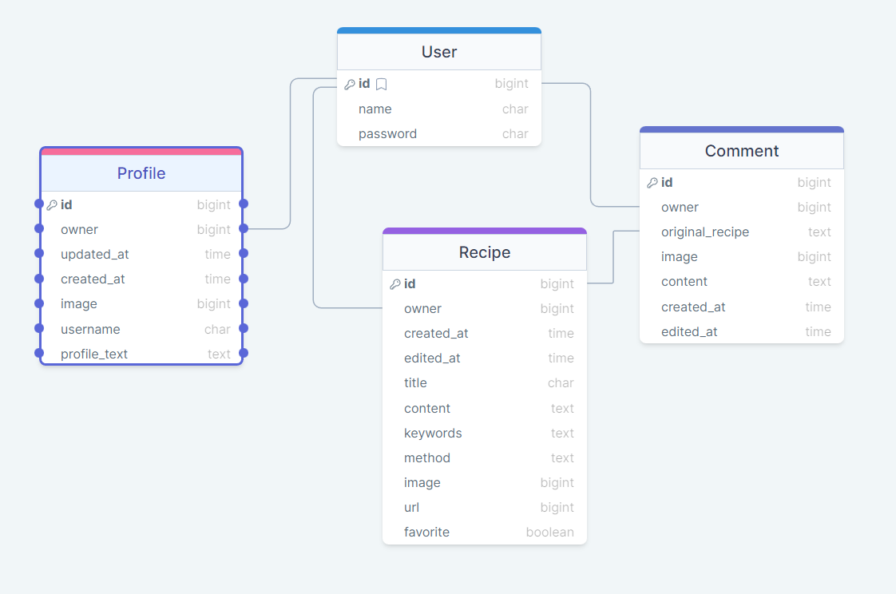

# drf API

This is the back end for the Potlucky project.

[Read more about the project from Potlucky readme](https://github.com/CozyPlantlady/potluck-recipe-app#readme)

Installed apps:

Cloudinary

Pillow

### Data Structure

---------SET UP-----------------------------------------------------------------------------------------

pip3 install 'django<4'

django-admin startproject drf_api .

pip install django-cloudinary-storage

pip install Pillow

---------Add these new apps to Settings.py in this order:-------------------------------------------------

'cloudinary_storage',
*'django.contrib.staticfiles',* already there
'cloudinary',

ENV:---------------------------------------------------------------------------------------------------------

import os

os.environ['CLOUDINARY_URL']='***'

Back in settings:--------------------------------------------------------------------------------------------

from pathlib import Path
import os

if os.path.exists('env.py'):
    import env

CLOUDINARY_STORAGE = {
    'CLOUDINARY_URL': os.environ.get('CLOUDINARY_URL')
}
MEDIA_URL = '/media'
DEFAULT_FILE_STORAGE = 'cloudinary_storage.storage.MediaCloudinaryStorage'

------------------------------------------------------------------------------------------------------------------
Lesson 2-Adding profiles------------------------------------------------------------------------------------------

python manage.py startapp profiles

add to settings - installed apps:    'profiles',

add to models.py :
from django.db.models.signals import post_save                 
from django.contrib.auth.models import User 

post_save.connect(create_profile, sender=User)

--------At the admin.py----------------------------------------------------------------

from .models import Profile

admin.site.register(Profile)

-------make migrations-----------------------------------------------------------------

python3 manage.py makemigrations
python3 manage.py migrate

-------Create admin--------------------------------------------------------------------

python3 manage.py createsuperuser

--------Run server---------------------------------------------------------------------

python3 manage.py runserver

--------Add requirements --------------------------------------------------------------

pip freeze > requirents.txt

------------------------------------------------------------------------------------------------------------------
Lesson 3-Profile resources-Rest framework Serializers-------------------------------------------------------------

pip install djangorestframework

add to settings.py under installed apps:          'rest_framework',

-----------Inside views.py----------------------------

from rest_framework.views import APIView
from rest_framework.response import Response
from .models import Profile

class ProfileList(APIView):
    def get(self, request):
        profiles = Profile.objects.all()
        return Response(profiles)

-----------Inside profiles/urls.py--------------------------------------------

from django.urls import path
from profiles import views

urlpatterns = [
    path('profiles/', views.ProfileList.as_view()),
]

-----------Inside drf_api/urls.py-------------------------------------------

from django.contrib import admin
from django.urls import path, include

urlpatterns = [
    path('admin/', admin.site.urls),
    path('', include('profiles.urls'))
]

--------------Create serializers.py------------------------------------------

from rest_framework import serializers
from .models import Profile

class ProfileSerializer(serializers.ModelSerializer):
    owner = serializers.ReadOnlyField(source='owner.username')

    class Meta:
        model = Profile
        fields = [
            'id', 'owner', 'created_at', 'updated_at', 'name',
            'content', 'image'
        ]

--------------Add to views.py--------------------------------------------------

from .serializers import ProfileSerializer

inside ProfileList class:

serializer = ProfileSerializer(profiles, many=True)
return Response(serializer.data)

pip freeze > requirements.txt

When you open the server, add /profiles to the end off address field to see the user information

------------------------------------------------------------------------------------------------------------------
Lesson 4-Profile resource-Profile details View: GET and PUT-------------------------------------------------------------
Fisrt, the GET part:

In the views.py, add highest up:

from django.http import Http404

Then add new class:

class ProfileDetail(APIView):
    def get_object(self, pk):
        try:
            profile = Profile.objects.get(pk=pk)
            return profile
        except Profile.DoesNotExist:
            raise Http404

    def get(self, request, pk):
        profile = self.get_object(pk)
        serializer = ProfileSerializer(profile)
        return Response(serializer.data)

--------In the profiles/url.py-------------------------------------------
urlpatterns:
path('profiles/<int:pk>/', views.ProfileDetail.as_view()),

-------------then the PUT part-------------------------------------------
Again, in the views.py file:

from rest_framework import status

continuing to add to the ProfileDetail class:

def put(self, request, pk):
        profile = self.get_object(pk)
        serializer = ProfileSerializer(profile, data=request.data)
        if serializer.is_valid():
            serializer.save()
            return Response(serializer.data)
        return Response(serializer.errors, status=status.HTTP_400_BAD_REQUEST)

----------------------------------------------------------------------------------------
-----------AUTHENTICATION, AUTHORIZATION AND SERIALIZER METHOD FIELDS-----------------------------------------------------------------------------

in drf.api/urls.py: 

 path('api-auth/', include('rest_frameworks.urls')),

-------Create new file, permissions.py---------------------

from rest_framework import permissions

class IsOwnerOrReadOnly(permissions.BasePermission):
    def has_object_permission(self, request, view, obj):
        if request.method in permissions.SAFE_METHODS:
            return True
        return obj.owner == request.user

--------Back to views.py------------------
from drf_api.permissions import IsOwnerOrReadOnly

add to class ProfileDeatail:
permission_classes = [IsOwnerOrReadOnly]

add to try:
        ...profile....
		self.check_object_permissions(self.request,profile)

-------add to every serializer in views.py: context={'request': request}-----

-----back at the permissions.py, continuing the ProfileSerializer class:------

 is_owner = serializers.SerializerMethodField()

    def get_is_owner(self, obj):
        request = self.context['request']
        return request.user == obj.owner